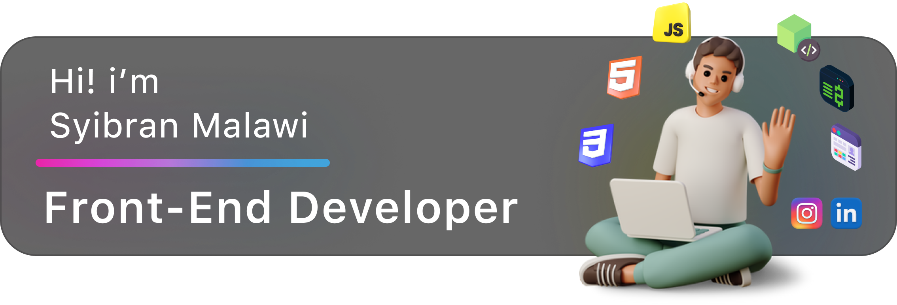

## About Me
  

  Hello, I'm <a>Syibran Malawi<>, an aspiring front-end web developer. I've been learning about programming since 2020, focusing primarily on web development. I have a deep passion for front-end design and am constantly striving to improve my skills, with the hope of growing and evolving in this exciting field.
  

   

## Stats

  

## Tech Stack:

  

## My Contribution

  
    

